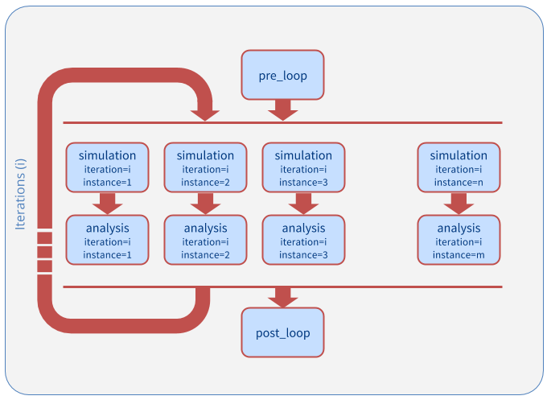

.. _getting_started:

***************
Getting Started
***************

ExTASY 0.2 uses the EnsembleMD Toolkit API for composing the application. In this section we will run you through the basics building blocks of the API. We will introduce the SimulationAnalysisLoop pattern and then work through simple examples using the same pattern. Once you are comfortable with these examples, in the next sections, we will present two molecular dynamics applications created using this API. 

SimulationAnalysisLoop (SAL): The Pattern
=========================================

The SAL pattern supports multiple iterations of two chained bag of tasks (BoT). The first bag consists of 'n' instances of simulations followed by the second bag which consists of 'm' instances of analysis. These analysis instances work on the output of the simulation instances and hence they are chained. There can be multiple iterations of these two BoTs. Depending on the application, it is possible to have the simulation instances of iteration 'i+1' work on the output of the analysis instances of iteration 'i'. There also exist two steps - pre_loop and post_loop to perform any pre- or post- processing. A graphical representation of the pattern is given below:

There are also a set of data references that can be used to reference the data in a particular step or instance.

* $PRE_LOOP - References the pre_loop step
* $PREV_SIMULATION - References the previous simulation step with the same instance number.
* $PREV_SIMULATION_INSTANCE_Y - References instance Y of the previous simulation step.
* $SIMULATION_ITERATION_X_INSTANCE_Y - References instance Y of the simulation step of iteration number X.
* $PREV_ANALYSIS - References the previous analysis step with the same instance number.
* $PREV_ANALYSIS_INSTANCE_Y - References instance Y of the previous analysis step.
* $ANALYSIS_ITERATION_X_INSTANCE_Y - References instance Y of the analysis step of iteration number X.

Components of the Pattern
=========================

Example 1: Multiple Simulations Single Analysis Application with SAL pattern
============================================================================

Example 2: Multiple Simulations Multiple Analysis Application with SAL pattern
==============================================================================