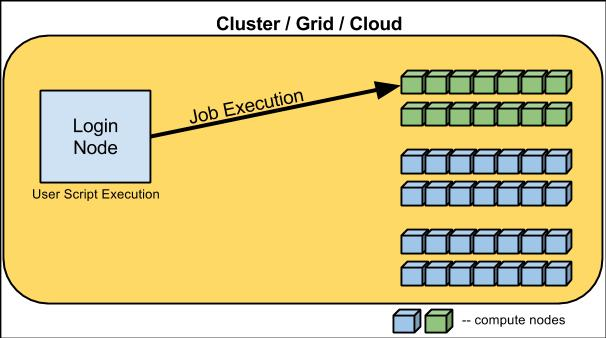
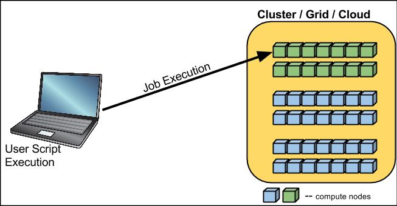

Remote - Remote Execution
===============================

In this method of execution, the user script is run from the login nodes of the cluster/grid and they are executed on 
the compute nodes. For this, the user will need to login to the cluster/grid and then start the user script.
 

Local - Remote Execution
===============================

In this method of execution, the user script is running on the user's personal machine but the job is executed on the
compute nodes of the cluster/grid. The user does not need to be logged into the cluster/grid, but would require a passwordless
login so that each of the jobs can be remotely submitted and executed on the remote machine.